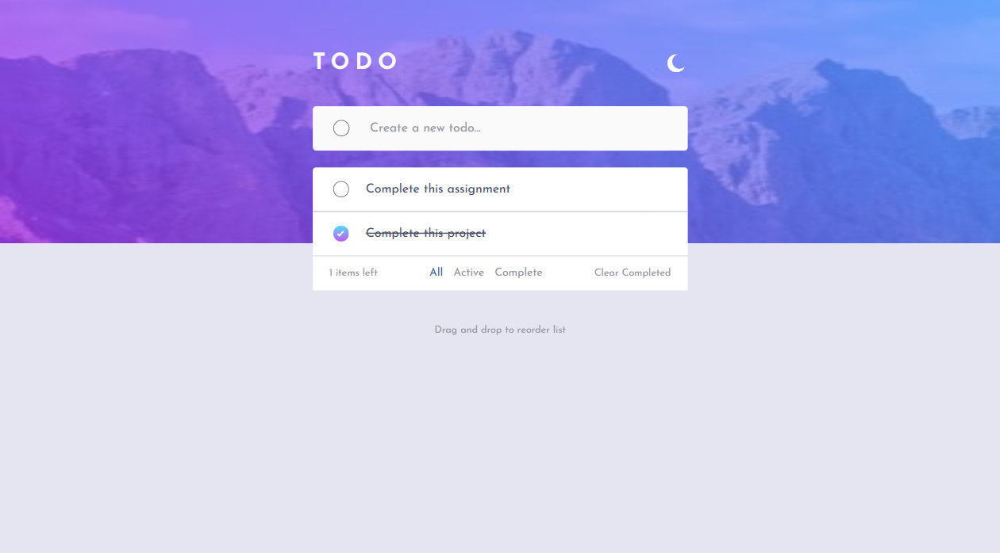
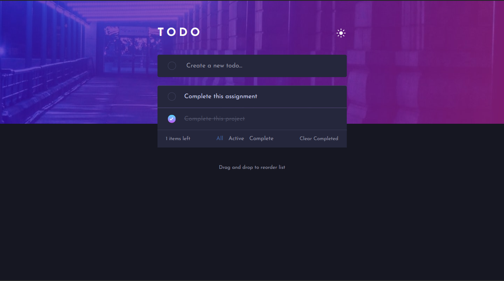
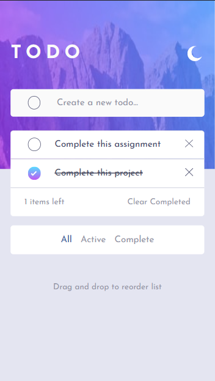
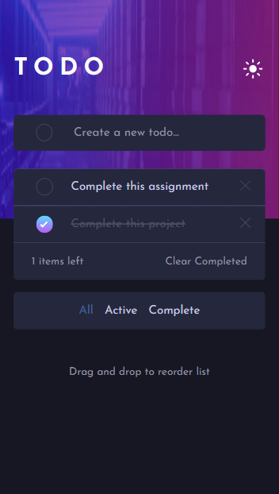

# Frontend Mentor - Todo app

# Frontend Mentor - Todo app solution

This is a solution to the [Todo app challenge on Frontend Mentor](https://www.frontendmentor.io/challenges/todo-app-Su1_KokOW). Frontend Mentor challenges help you improve your coding skills by building realistic projects. 

## Table of contents

- [Overview](#overview)
  - [The challenge](#the-challenge)
  - [Screenshot](#screenshot)
  - [Links](#links)
- [My process](#my-process)
  - [Built with](#built-with)
  - [What I learned](#what-i-learned)
  - [Continued development](#continued-development)
  - [Useful resources](#useful-resources)
- [Author](#author)
- [Acknowledgments](#acknowledgments)

**Note: Delete this note and update the table of contents based on what sections you keep.**

## Overview

### The challenge

Users should be able to:

- View the optimal layout for the app depending on their device's screen size
- See hover states for all interactive elements on the page
- Add new todos to the list
- Mark todos as complete
- Delete todos from the list
- Filter by all/active/complete todos
- Clear all completed todos
- Toggle light and dark mode
- **Bonus**: Drag and drop to reorder items on the list

### Screenshot

- Desktop Light

- Desktop Dark

- Mobile Light / Dark

     

### Links

- Solution URL: [https://github.com/the-bipu/ToDo-App-Main](https://github.com/the-bipu/ToDo-App-Main)
- Live Site URL: [https://todo-app-the-bipu.netlify.app/](https://todo-app-the-bipu.netlify.app/)

## My process

### Built with

- Semantic HTML5 markup
- CSS custom properties
- Flexbox
- CSS Grid
- Mobile-first workflow
- [React](https://reactjs.org/) - JS library
- [Sanity](https://www.sanity.io/) - For Storing Data
- [Sass](https://sass-lang.com/) - For styles

### What I learned

### Continued development

This project is fully complete as per the given challenges but i would like to use database for it and make it a fully-fledged website where the user can store it's Todos by logging in.

### Useful resources

## Author

- Github - [The-Bipu](https://github.com/the-bipu)
- Frontend Mentor - [@the-bipu](https://www.frontendmentor.io/profile/the-bipu)

## Acknowledgments

Until now i haven't seen the solution of any other person but i use chatGPT a lot when i need to debug a code section, or when i have to understand a concept.